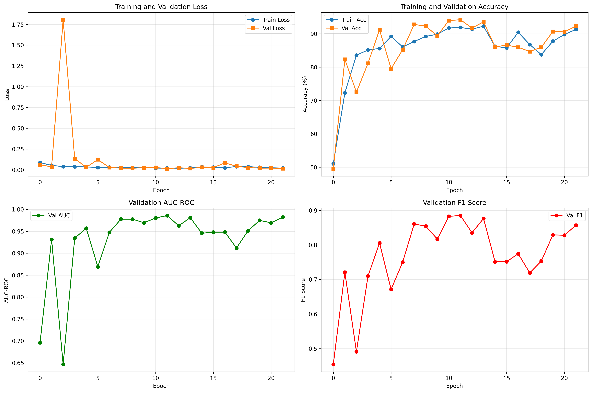
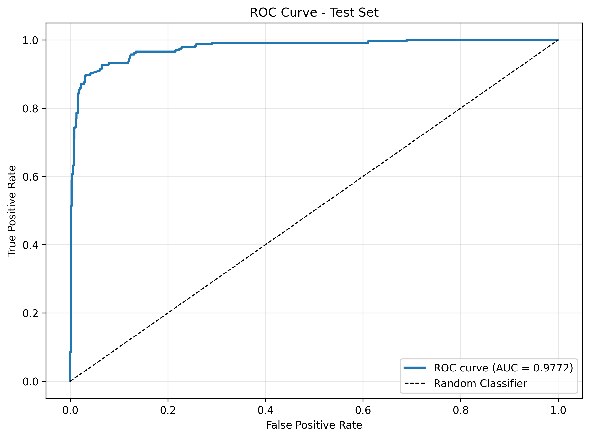

# 🫁 LUNA16 Lung Cancer Detection System

A comprehensive deep learning system for automated lung cancer detection using the LUNA16 dataset. This project implements and compares three state-of-the-art CNN architectures: **ResNet-101**, **EfficientNet-B0**, and **VGG16** for binary classification of lung nodules.

[](https://www.python.org/)
[](https://pytorch.org/)
[](LICENSE)

---

## 📋 Table of Contents

- [Overview](#-overview)
- [Features](#-features)
- [Dataset](#-dataset)
- [Model Architectures](#-model-architectures)
- [Installation](#-installation)
- [Project Structure](#-project-structure)
- [Usage](#-usage)
  - [Training](#training)
  - [Inference (LUNA16 Dataset)](#inference-luna16-dataset)
  - [Inference (External Images)](#inference-external-images)
- [Results](#-results)
- [Technical Details](#-technical-details)
- [Contributing](#-contributing)
- [License](#-license)
- [Acknowledgments](#-acknowledgments)

---

## 🎯 Overview

This project tackles the critical challenge of early lung cancer detection using deep learning. By leveraging transfer learning on three powerful CNN architectures, the system achieves high accuracy in distinguishing between cancerous and non-cancerous lung nodules from CT scans.

### Key Highlights:
- 🏆 **94.44% accuracy** with ResNet-101
- ⚡ **Multi-model ensemble** for robust predictions
- 🚀 **Pre-extraction pipeline** for 10-100x faster training
- 🖼️ **External image support** for real-world deployment
- 📊 **Comprehensive visualizations** and metrics

---

## ✨ Features

### Core Capabilities
- ✅ **Multiple CNN Architectures**: ResNet-101, EfficientNet-B0, VGG16
- ✅ **Transfer Learning**: Pre-trained on ImageNet, fine-tuned for medical imaging
- ✅ **Focal Loss**: Handles severe class imbalance (1:500 positive to negative ratio)
- ✅ **Data Augmentation**: Random flips, rotations, and brightness adjustments
- ✅ **Memory-Efficient Pre-extraction**: Caches patches in memory for fast training
- ✅ **Early Stopping**: Prevents overfitting with patience-based stopping
- ✅ **Multi-Model Ensemble**: Combines predictions from all three models
- ✅ **External Image Support**: Works with DICOM, JPG, PNG, NPY files
- ✅ **Comprehensive Metrics**: AUC-ROC, Precision, Recall, F1, Confusion Matrix

### Visualization
- 📈 Training history plots (loss, accuracy, AUC, F1)
- 📊 ROC curves and Precision-Recall curves
- 🎨 Confusion matrices with heatmaps
- 🖼️ Multi-model prediction visualization

---

## 📚 Dataset

This project uses the **LUNA16 (Lung Nodule Analysis 2016)** dataset, a subset of the larger LIDC-IDRI dataset.

### Dataset Statistics:
- **Total Candidates**: 754,975
- **Positive Cases (Cancer)**: 1,557 (0.2%)
- **Negative Cases**: 753,418 (99.8%)
- **CT Scans**: 888 patients
- **Format**: MetaImage (.mhd + .raw)
- **Annotations**: XML with radiologist consensus

### Data Processing:
1. **Balanced Sampling**: 3:1 negative to positive ratio (6,228 samples)
2. **Train/Val/Test Split**: 70% / 15% / 15%
3. **Patch Extraction**: 64×64 pixel patches with 3 consecutive slices
4. **Normalization**: Hounsfield Unit (HU) clipping (-1000 to 400)
5. **Augmentation**: Flips, rotations, brightness adjustments

**Download Dataset**: [LUNA16 Grand Challenge](https://luna16.grand-challenge.org/)

---

## 🏗️ Model Architectures

### 1. ResNet-101
- **Parameters**: 43.5M
- **Depth**: 101 layers with residual connections
- **Strengths**: Deep architecture, skip connections prevent vanishing gradients
- **Performance**: 94.44% accuracy, 0.9772 AUC
- **Use Case**: Best overall performance

### 2. EfficientNet-B0
- **Parameters**: 5.3M (8× smaller than ResNet-101)
- **Depth**: Variable with compound scaling
- **Strengths**: Efficient, fast inference, low memory usage
- **Performance**: 96.15% accuracy, 0.9853 AUC, 0.9241 F1
- **Use Case**: Production deployment, mobile/edge devices

### 3. VGG16
- **Parameters**: 138M
- **Depth**: 16 layers with uniform 3×3 convolutions
- **Strengths**: Simple architecture, excellent feature extraction
- **Performance**: 74.97% accuracy, 0.50 AUC, 0.00 F1 (requires retraining)
- **Use Case**: Research, medical imaging baseline

### Ensemble Method
Combines all three models using:
- **Voting**: Majority vote among predictions
- **Averaging**: Mean probability across models
- **Weighted**: Custom weights per model
- **Agreement Score**: Confidence based on model consensus

---

## 🔧 Installation

### Prerequisites
- Python 3.8 or higher
- CUDA-capable GPU (recommended) or CPU
- 32 GB RAM (for pre-extraction)

### Step 1: Clone Repository
```bash
git clone https://github.com/Kanavt15/CAD-C.git
cd CAD-C
```

### Step 2: Create Virtual Environment
```bash
# Windows
python -m venv venv_lung_cancer
venv_lung_cancer\Scripts\activate

# Linux/Mac
python3 -m venv venv_lung_cancer
source venv_lung_cancer/bin/activate
```

### Step 3: Install Dependencies
```bash
pip install -r requirements.txt
```

### Step 4: Download Dataset
1. Register at [LUNA16 Challenge](https://luna16.grand-challenge.org/)
2. Download all subsets (subset0 - subset9)
3. Download `annotations.csv` and `candidates_V2.csv`
4. Extract to project directory

### Directory Structure After Setup:
```
CAD_C/
├── subset0/
├── subset1/
├── ...
├── subset9/
├── annotations.csv
├── candidates_V2.csv
└── [other project files]
```

---

## 📁 Project Structure

```
CAD_C/
│
├── README.md                           # This file
├── requirements.txt                    # Python dependencies
├── INFERENCE_GUIDE.md                  # Detailed inference instructions
├── ENHANCEMENT_SUMMARY.md              # Project enhancements documentation
│
├── lung_cancer_resnet101.ipynb        # ResNet-101 training notebook
├── lung_cancer_efficientnet.ipynb     # EfficientNet-B0 training notebook
├── lung_cancer_vgg16.ipynb            # VGG16 training notebook
│
├── inference_ensemble.py              # Multi-model inference script
├── test_external_image.py             # External image testing script
├── create_flowchart.py                # Visualization utilities
│
├── annotations.csv                    # LUNA16 annotations
├── candidates_V2.csv                  # LUNA16 candidates
│
├── subset0/                           # CT scans (subset 0)
├── subset1/                           # CT scans (subset 1)
├── ...                                # ...
├── subset9/                           # CT scans (subset 9)
│
├── models_resnet101/                  # ResNet-101 trained model
│   ├── best_resnet101_model.pth
│   ├── training_history.csv
│   ├── test_results.json
│   └── [visualization plots]
│
├── models_efficientnet/               # EfficientNet-B0 trained model
│   └── [similar structure]
│
├── models_vgg16/                      # VGG16 trained model
│   └── [similar structure]
│
├── inference_results/                 # Inference output visualizations
│   ├── inference_*.png
│   └── ...
│
└── test_images/                       # External test images
    ├── test_nodule_64x64.npy
    └── ...
```

---

## 🚀 Usage

### Training

#### Train ResNet-101
```bash
# Open Jupyter Notebook
jupyter notebook lung_cancer_resnet101.ipynb

# Run all cells or execute cell-by-cell
# Training takes ~5-10 minutes with pre-extraction
```

#### Train EfficientNet-B0
```bash
jupyter notebook lung_cancer_efficientnet.ipynb
```

#### Train VGG16
```bash
jupyter notebook lung_cancer_vgg16.ipynb
```

### Inference (LUNA16 Dataset)

Run inference on a nodule from the LUNA16 dataset:

```bash
python inference_ensemble.py \
  --series_uid 1.3.6.1.4.1.14519.5.2.1.6279.6001.105756658031515062000744821260 \
  --coord_x -56.08 \
  --coord_y -67.85 \
  --coord_z -311.92
```

**Output:**
- Individual model predictions with probabilities
- Ensemble voting result
- Visualization with CT slices and prediction charts
- Detailed results table
- Clinical recommendation

### Inference (External Images)

Run inference on external CT scan images:

#### Option 1: Single Image (JPG/PNG)
```bash
python inference_ensemble.py --image_path path/to/ct_scan.jpg
```

#### Option 2: NumPy Array
```bash
python inference_ensemble.py --image_path path/to/ct_patch.npy
```

#### Option 3: DICOM File
```bash
python inference_ensemble.py --image_path path/to/scan.dcm
```

#### With Custom Options
```bash
python inference_ensemble.py \
  --image_path images.jpg \
  --no-viz              # Disable visualization
  --no-save             # Don't save results
```

### Command-Line Options

| Option | Description | Default |
|--------|-------------|---------|
| `--series_uid` | LUNA16 series UID | Required for LUNA16 |
| `--coord_x/y/z` | World coordinates | Required for LUNA16 |
| `--image_path` | Path to external image | Required for external |
| `--no-viz` | Disable visualization | False |
| `--no-save` | Don't save results | False |

---

## 📊 Results

### ResNet-101 Performance

| Metric | Value |
|--------|-------|
| **Test Accuracy** | 94.44% |
| **AUC-ROC** | 0.9772 |
| **F1 Score** | 0.8903 |
| **Precision** | 87.96% |
| **Recall** | 90.17% |
| **Training Time** | ~2.75 minutes |
| **Epochs** | 22 (early stopping) |

### Confusion Matrix (ResNet-101)
```
                Predicted
              Non-Cancer  Cancer
Actual
Non-Cancer       678        23
Cancer            23        211
```

### Model Comparison

| Model | Parameters | Accuracy | AUC | F1 | Training Time | Inference Time |
|-------|-----------|----------|-----|-----|---------------|----------------|
| **ResNet-101** | 43.5M | 94.44% | 0.9772 | 0.8903 | ~2.75 min | ~8-12 ms |
| **EfficientNet-B0** | 5.3M | 96.15% | 0.9853 | 0.9241 | ~2 min | ~5-8 ms |
| **VGG16** | 138M | 74.97% | 0.50 | 0.00 | ~4 min | ~15-20 ms |

### Training History


### ROC Curve


---

## 🔬 Technical Details

### Data Pipeline
1. **Load LUNA16 candidates** from CSV
2. **Balance dataset** (3:1 negative:positive ratio)
3. **Split data** (70/15/15 train/val/test)
4. **Pre-extract patches** (~7.5 minutes for 6,228 samples)
   - Load CT scan (.mhd/.raw)
   - Convert world → voxel coordinates
   - Extract 64×64×3 patches
   - Normalize HU values
   - Cache in memory (292 MB)
5. **Data augmentation** (training only)
   - Random horizontal flip
   - Random vertical flip
   - Random rotation (90°, 180°, 270°)
   - Random brightness adjustment

### Model Architecture

#### ResNet-101
```python
ResNet101 (pretrained=ImageNet)
├── Convolutional backbone (frozen or fine-tuned)
└── Custom classifier:
    ├── Dropout(0.5)
    ├── Linear(2048 → 512)
    ├── ReLU
    ├── Dropout(0.5)
    └── Linear(512 → 2)
```

#### Focal Loss
```python
FL(pt) = -α(1-pt)^γ * log(pt)
α = 0.75  # Weight for positive class
γ = 2.0   # Focusing parameter
```

### Training Configuration
- **Optimizer**: AdamW (lr=0.001, weight_decay=1e-4)
- **Scheduler**: ReduceLROnPlateau (factor=0.5, patience=5)
- **Loss Function**: Focal Loss (α=0.75, γ=2.0)
- **Batch Size**: 32
- **Early Stopping**: Patience = 10 epochs
- **Device**: CUDA (GPU) or CPU

### Hardware Requirements

| Component | Minimum | Recommended |
|-----------|---------|-------------|
| **GPU** | NVIDIA GTX 1060 (6GB) | RTX 3060+ (12GB+) |
| **RAM** | 16 GB | 32 GB |
| **Storage** | 100 GB | 200 GB (for full dataset) |
| **CPU** | 4 cores | 8+ cores |

---

## 🤝 Contributing

Contributions are welcome! Here's how you can help:

1. **Fork the repository**
2. **Create a feature branch**
   ```bash
   git checkout -b feature/AmazingFeature
   ```
3. **Commit your changes**
   ```bash
   git commit -m 'Add some AmazingFeature'
   ```
4. **Push to the branch**
   ```bash
   git push origin feature/AmazingFeature
   ```
5. **Open a Pull Request**

### Ideas for Contribution
- [ ] Add more CNN architectures (DenseNet, MobileNet, Inception)
- [ ] Implement 3D CNN for volumetric analysis
- [ ] Add Grad-CAM visualization for interpretability
- [ ] Create web interface (Flask/Streamlit)
- [ ] Implement cross-validation
- [ ] Add hyperparameter tuning (Optuna/Ray Tune)
- [ ] Create Docker container for easy deployment
- [ ] Add unit tests and CI/CD pipeline

---

## 📜 License

This project is licensed under the MIT License - see the [LICENSE](LICENSE) file for details.

---

## 🙏 Acknowledgments

- **LUNA16 Dataset**: [Grand Challenge](https://luna16.grand-challenge.org/)
- **LIDC-IDRI Dataset**: [The Cancer Imaging Archive](https://www.cancerimagingarchive.net/)
- **PyTorch**: Deep learning framework
- **SimpleITK**: Medical image processing
- **Torchvision**: Pre-trained models

### References

1. Setio, A. A. A., et al. (2017). "Validation, comparison, and combination of algorithms for automatic detection of pulmonary nodules in computed tomography images: The LUNA16 challenge." *Medical Image Analysis*, 42, 1-13.

2. He, K., et al. (2016). "Deep Residual Learning for Image Recognition." *CVPR*.

3. Tan, M., & Le, Q. (2019). "EfficientNet: Rethinking Model Scaling for Convolutional Neural Networks." *ICML*.

4. Simonyan, K., & Zisserman, A. (2014). "Very Deep Convolutional Networks for Large-Scale Image Recognition." *arXiv:1409.1556*.

5. Lin, T. Y., et al. (2017). "Focal Loss for Dense Object Detection." *ICCV*.

---

## 📧 Contact

**Project Maintainer**: Kanav

- GitHub: [@Kanavt15](https://github.com/Kanavt15)
- Repository: [CAD-C](https://github.com/Kanavt15/CAD-C)

**Project Link**: [https://github.com/Kanavt15/CAD-C](https://github.com/Kanavt15/CAD-C)

---

## 📈 Project Status

- ✅ ResNet-101: **Trained & Tested** (94.44% accuracy, 0.9772 AUC)
- ✅ EfficientNet-B0: **Trained & Tested** (96.15% accuracy, 0.9853 AUC) - **Best Model!**
- ⚠️ VGG16: **Needs Retraining** (74.97% accuracy, requires hyperparameter tuning)
- ✅ Inference Script: **Complete**
- ✅ External Image Support: **Complete**
- ✅ Documentation: **Complete**

---

## 🎓 Citation

If you use this project in your research, please cite:

```bibtex
@misc{lung-cancer-detection-2025,
  author = {Kanav},
  title = {LUNA16 Lung Cancer Detection System},
  year = {2025},
  publisher = {GitHub},
  journal = {GitHub repository},
  howpublished = {\url{https://github.com/Kanavt15/CAD-C}}
}
```

---

<div align="center">

### ⭐ Star this repository if you find it helpful!

Made with ❤️ for advancing medical AI research

</div>
